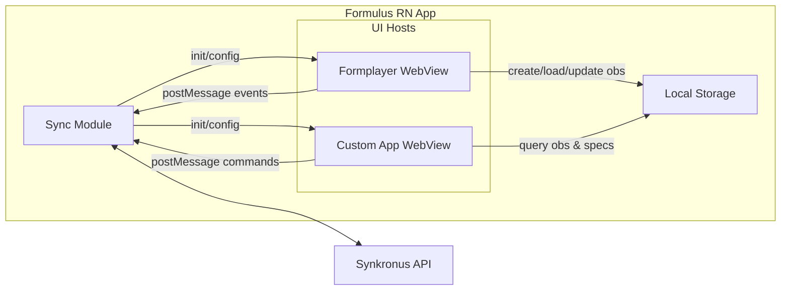

# Formulus Formplayer

This app implements the core functionality to render and submit forms to Formulus (which can then sync with Synkronus).

# Usage in custom apps
Primarily the formplayer exposes a javascript interface, that is injected into the custom app and can be used to render forms based on the jsonform spec's provided by formulus (formulus downloads the jsonform spec's and question_types from synkronus). Likewise, all of the question_types provided are loaded into the formplayer at initialization (by the formulus app) and can thus be used in the forms.

## Responsibility of the Formulus Formplayer
The formplayer is solely responsible for 
- rendering the forms
    - create new observations
    - edit existing observations
    - validate form responses
- loading previously saved data (if the form is opened with a valid observation_id)
- submitting the forms to Formulus (either as draft or final)
- (soft-)deleting observations

## Development setup
This project depends on `@ode/tokens` (local `packages/tokens`). On a fresh clone or new branch, install in order:

1. From repo root: `cd packages/tokens && npm install`
2. Then: `cd formulus-formplayer && npm install && npm start`

If you run `npm install` only in formulus-formplayer, the tokens package’s `prepare` script may fail with "Cannot find module 'style-dictionary'" until tokens has its own dependencies installed.

## Building this project
Use 'npm run build:rn' to build the project. This will build the project and copy the build to the formulus app. 

## Javascript interface

The javascript interface made available to the custom app is as follows:

```javascript
window.formulus.formplayer = {
   addObservation(formType, initializationData)
   editObservation(formType, observationId)
   ~~~deleteObservation(formType, observationId)~~~ // TODO: Will be implemented in formulus core interface
   ...
}
```

### addObservation

```javascript
window.formulus.addObservation(formType, initializationData)
```
formType: The type of the form to be rendered. Notice that formulus will always use the latest version of a form to render the form.
initializationData: An object containing any initialization data that should be passed to the form


### editObservation

```javascript
window.formulus.editObservation(formType, observationId)
```
formType: The type of the form to be rendered. Editing an existing observation will always use the version of the form that was used to create the observation.
observationId: The id of the observation to be edited


### deleteObservation

```javascript
window.formulus.deleteObservation(formType, observationId)
```
formType: The type of the form to be rendered
observationId: The id of the observation to be deleted

## Initialization
The formulus formplayer object will be initialized by the formulus app. The formulus app will inject the initialized formulus object into the custom app, hence **the custom app does not need to do anything to initialize the formulus object**.

```javascript
new formulus.formplayer(
    config
)
```

config: An object containing the configuration for the formulus formplayer object. The config object should have the following properties:
- renderers: An array of renderers to be used by the formplayer. Renderers are container components responsible for rendering the form.
- cells: An array of cells to be used by the formplayer. Cells maps to `question types` and are components responsible for handling specific input types - e.g. text input cell, date input cell, etc. Core formulus provides the following cells:
    - text cell
    - date cell
    - time cell
    - datetime cell
    - number cell
    - boolean cell
    - select cell
    - select multiple cell
    - file cell
    - image cell
    - signature cell
    - barcode cell
    - qr code cell
    - location cell
Any other cells, either custom developed or provided by the community, will be included as well once they are downloaded from synkronus as part of the normal sync process.
- formSpecs: An array of jsonform formSpecs to be used by the formplayer wrapped in an envelope object: `{formType: string, version: string, spec: any}`


## Available `npm` scripts

In the project directory, you can run:

- `npm start` Runs the app in the development mode. Open [http://localhost:3000](http://localhost:3000) to view it in the browser.
- `npm test`. Launches the test runner in the interactive watch mode.
- `npm run build`. Builds the app for production to the `build` folder. It correctly bundles React in production mode and optimizes the build for the best performance.

The build is minified and the filenames include the hashes.

